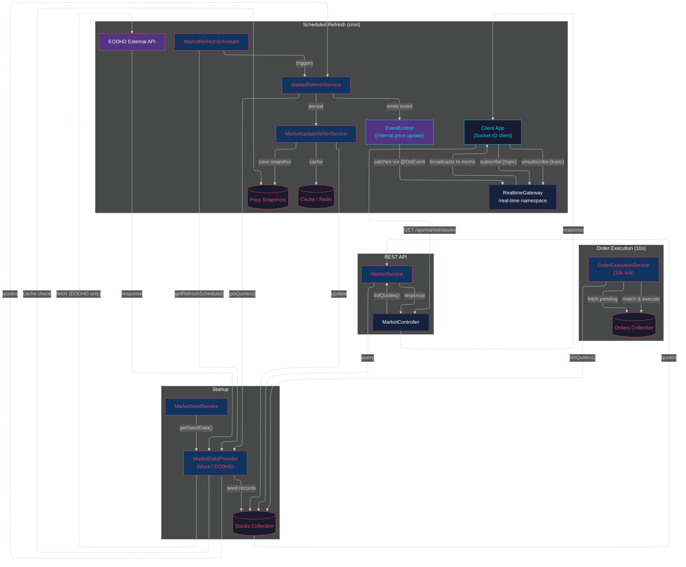

# Data Flow Diagram

## Flow Summary

| Flow | Trigger | What happens |
|------|---------|-------------|
| **Startup** | Server starts | Seeds stock records from provider's `getSeedData()` |
| **Scheduled Refresh** | Cron (EODHD: 6:30 PM weekdays) | Fetches quotes from provider → persists to DB + snapshots → emits `internal.price.update` event |
| **Client Subscription** | Client WebSocket message | Client subscribes/unsubscribes to stock rooms (e.g. `stock:AAPL`) |
| **Real-time Broadcast** | Internal event `internal.price.update` | `RealtimeGateway` catches the event → broadcasts `price_update` to subscribed room members |
| **Order Execution** | Every 10 seconds | Reads latest prices from DB → matches pending limit orders → executes |
| **REST API** | Client request | Reads from DB → returns quotes |

## Key Design Rules

### Market Data Provider
The `MarketDataProvider` interface is the **single extension point**. Adding a new provider requires:
1. Implement the interface
2. Register in `ProviderFactory`
3. Set `MARKET_PROVIDER` env var

**Zero service changes needed.**

### Real-time Gateway (The Megaphone Rule)
The `RealtimeGateway` MUST NOT contain cron jobs, external API calls, or business logic.
It receives data EXCLUSIVELY by listening to internal server events via `@nestjs/event-emitter`.

### Adding new real-time event types
1. Emit the event from the domain service: `this.eventEmitter.emit('internal.your.event', payload)`
2. Add an `@OnEvent('internal.your.event')` handler in `RealtimeGateway`
3. Define the client-facing event name and room targeting
