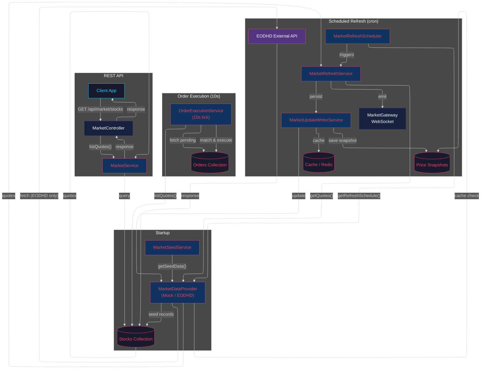

# Data Flow Diagram

## Flow Summary

| Flow | Trigger | What happens |
|------|---------|-------------|
| **Startup** | Server starts | Seeds stock records from provider's `getSeedData()` |
| **Scheduled Refresh** | Cron (EODHD: 6:30 PM weekdays) | Fetches quotes from provider → persists to DB + snapshots → emits via WebSocket |
| **Order Execution** | Every 10 seconds | Reads latest prices from DB → matches pending limit orders → executes |
| **REST API** | Client request | Reads from DB → returns quotes |

## Key Design Rule

The `MarketDataProvider` interface is the **single extension point**. Adding a new provider requires:

1. Implement the interface
2. Register in `ProviderFactory`
3. Set `MARKET_PROVIDER` env var

**Zero service changes needed.**
